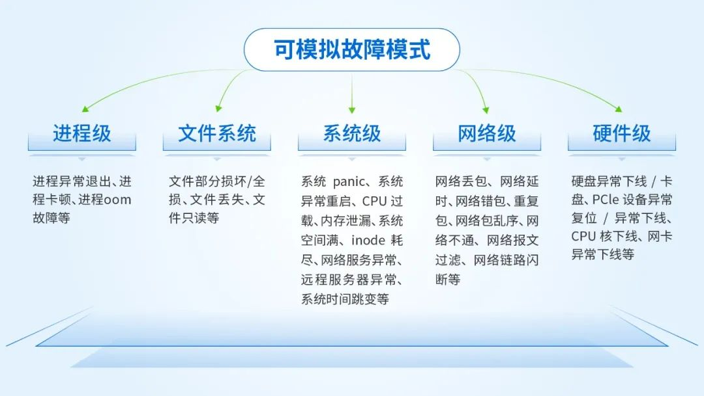
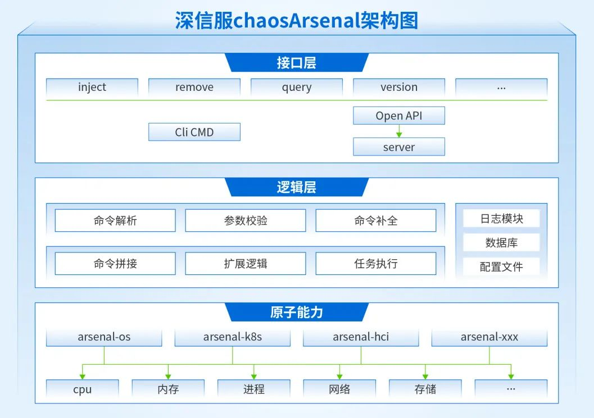

# chaosArsenal故障注入工具

### 工具简介
`chaosArsenal`是深信服开源的一款linux系统下通用的可靠性测试工具，通过在系统中模拟软/硬件故障，验证系统在遇到可能发生故障时的抵御能力或帮助发现系统中可能存在的漏洞。`chaosArsenal`专注于对linux系统软硬件故障场景模拟，契合分布式系统中对基础硬件、操作系统、中间件、业务应用等稳定性测试的强烈需求。当前开源版本覆盖的故障场景以通用、常见为主，共开源了30+的故障模式模拟能力(如下图)，覆盖50多个故障场景，具体的故障模式信息、原理以及命令示例可以参考`chaosArsenal`工具使用手册.md。



### 特点

- 核心设计思想为简单易用，可实现快速部署上线，工具解压即可使用。

- 支持多种原子故障注入能力，如CPU、内存、网络、文件系统、进程、磁盘、PCIE等多种软硬件场景。

- 良好的拓展能力，可以根据实际业务需求快速添加自定义原子故障注入能力，实现能力拓展。

- 支持多种调用接口， 支持cli和http两种控制接口，满足多种用户场景需求。


### 软件架构
chaosArsenal软件架构说明



`chaosArsenal`工具整体架构主要分为接口层、逻辑层和原子能力。


  - ​接口层:

    提供故障注入、故障清除、故障查询等接口，支持cli和http两种方式调用。

    -	`cli` 部分采用`cobra`框架，初始化`root`命令之后，通过解析`arsenal-spec-1.0.0.json`配置文和输入参数补全完整命令。
    -   `http`部分采用`openApi`设计，用`swagger`生成`http`服务端代码，需要先将后台server服务端启动，再执行相应接口操作，启动方式参考“OpenAPI调用->启动server服务端”。

  - 逻辑层：

    ​逻辑层主要是用来处理接口层下发的命令，对命令进行解析，解析故障模式、故障注入参数等信息，并根据配置文件中相关信息，进行原子故障注入命令的拼接和故障注入任务执行操作，该过程会记录操作日志，并将故障注入信息写在数据库中。

    ​其中日志模块、数据库、配置文件下面会介绍相关信息。


  - 原子能力：

    原子能力是具体执行故障注入的各领域故障注入能力集，`chaosArsenal v1.0.0`版本开源`os`和`hardware`领域的部分能力。


### 编译

#### 依赖软件
Go 1.18.x以及以上。
#### 编译环境
Linux系统(已验证系统ubutnu、Centos)。
#### 快速构建
直接在Makefile所在目录下执行make命令，编译生成执行文件路径output/chaosArsenal/。

### 使用说明
#### 	`OpenAPI`调用

​	  `arsenal`可以根据配置文件中参数可选/必选、参数个数、参数名等信息进行参数合法性校验。

##### 		默认`HTTP`端口

​	  如果未指定`http`端口则默认的服务端端口为`9095`。

#####		启动`server`服务端

   -  不带任何参数启动`server`服务端，默认的服务端口为` http://127.0.0.1:9095`

      ```bash
      ./arsenal server start

- 带`ip`和`port`启动server服务端

  ```bash
  ./arsenal server start --host=10.103.176.172 --port=9095
  ```

- 只带`ip`启动server服务端，默认端口为`9095`

  ```bash
  ./arsenal server start --host=10.103.176.172
  ```

- 关闭server服务端

  ```bash
  ./arsenal server stop --signal stop
  ```

  

##### 注入

​	注入命令的所有参数放置在`http`请求头，`params`为传入某个故障模式的所有参数。

- 单参数

  ```bash
  curl -X 'POST' 'http://10.103.176.172:9095/arsenal/v1/faults' -H "Content-Type: application/json" -d '{"class": "os", "domain": "file", "fault-mode": "lost", "params": {"path":"/home/curtis/work/arsenal-os/kk.sh"}}'
  ```

- 多参数

  ```bash
  curl -X 'POST' 'http://10.103.176.172:9095/arsenal/v1/faults' -H "Content-Type: application/json" -d '{"class": "os", "domain": "file", "fault-mode": "corruption", "timeout": "10s", "params": {"path":"/home/curtis/work/arsenal-os/kk.sh", "offset": "2", "length": "3"}}'
  ```

- 带`timeout`可选参数

  ```bash
  curl -X 'POST' 'http://10.103.176.172:9095/arsenal/v1/faults' -H "Content-Type: application/json" -d '{"class": "os", "domain": "file", "fault-mode": "corruption", "timeout": "10s", "params": {"path":"/home/curtis/work/arsenal-os/kk.sh", "offset": "2", "length": "3"}}'
  ```

​	`timeout`参数格式

```bash
pattern: ^(?:(\d+d):)?(?:(\d+h):)?(?:(\d+m):)?(?:(\d+s))?$
```

​	说明：天、小时、分钟、秒，可进行任意组合使用，以`:`分割。

##### 清理

​	根据注入时返回的`uuid`来清理已经注入的命令。

```bash
curl -X 'DELETE' 'http://10.103.176.172:9095/arsenal/v1/faults/5d81e8f58ef7e8a1'	
```

##### 查询

- 匹配单一字段

  ```bash
  curl -X 'GET' 'http://10.103.176.172:9095/arsenal/v1/faults?uuid=5d81e8f58ef7e8a1'
  ```

- 匹配多个字段

  ```bash
  curl -X 'GET' 'http://10.103.176.172:9095/arsenal/v1/faults?uuid=5d81e8f58ef7e8a1&domain=file'
  ```


#### `CLI`命令调用

##### 注入

- 常规命令

  ```bash
  ./arsenal inject os file corruption --path /home/curtis/work/arsenal-os/kk.sh --length 3 --offset 2
  ```

- 带`timeout`参数

  `timeout`参数用来做延时故障自动清理操作。

  ```bash
  ./arsenal inject os file corruption --path /home/curtis/work/arsenal-os/kk.sh --length 3 --offset 2 --timeout 1m:30s
  ```

  timeout参数格式
  
  ```bash
  pattern: ^(?:(\d+d):)?(?:(\d+h):)?(?:(\d+m):)?(?:(\d+s))?$
  ```
  
  说明：天、小时、分钟、秒，可进行任意组合使用，以`:`分割。

##### 清理

- `cli`命令完整命令清除。

  ```bash
  ./arsenal remove os file corruption --path /home/curtis/work/arsenal-os/kk.sh --length 3 --offset 2
  ```

- 根据`uuid`参数清理。

  根据`uuid`在数据库中查找对应表项，获得故障注入信息。

  ```bash
  ./arsenal remove --uuid 5d81e8f58ef7e8a1
  ```

  

##### 查询

- 匹配单一字段。

  ```bash
  ./arsenal query --uuid 5d81e8f58ef7e8a1
  ```

- 匹配多个字段。

  ```bash
  ./arsenal query --uuid 5d81e8f58ef7e8a1 --domain file
  ```

  


#### `cli`命令补全

```bash
./arsenal completion bash
```


### `sqlite`数据库

​		`chaosArsenal`工具中使用`sqlite`数据库记录故障注入信息，用于工具对故障注入对象的重复注入检查和故障恢复，也方便用户对已注入故障的查询操作等。数据库名为`arsenal.db`文件。

#### `sqlite`数据库字段信息

​		数据库中字段及其类型如下：

```go
   	"id" INTEGER PRIMARY KEY AUTOINCREMENT,
	"UUID" VARCHAR(32) UNIQUE,
	"interactive_mode" VARCHAR NOT NULL,
	"class" VARCHAR NOT NULL,
	"domain" VARCHAR NOT NULL,
	"fault_mode" VARCHAR NOT NULL,
	"object" VARCHAR NOT NULL,
    "flags" VARCHAR,
    "private" VARCHAR,
	"proactive_cleanup" BOOL,
    "status" VARCHAR NOT NULL,
    "inject_time" VARCHAR NOT NULL,
	"update_time" VARCHAR NOT NULL
```

​		数据库中字段信息介绍：	

- `id`
  数据库表索引。
- `UUID`
  故障注入时产生的16位uuid。
- `interactive_mode`
  交互模式，数据库中记录故障相关操作的交互方式，当前存在两种模式`cli`和`http`。
- `class`
  故障类别，比如操作系统故障、硬件故障、容器故障等
- `domain`
  故障的作用域，比如说`process`、`file`等，表示故障所属的域。
- `fault_mode`
  具体的故障模式。
- `object`
  记录故障注入的对象。
- `flags`
  记录传入的所有参数，格式示例`--path /home/curtis/work/arsenal-os/kk.sh`
- `private`
  私有数据区，用在`timeout`的场景，`cli`场景下用于记录后台执行进程的`pid`和`timeout`延迟清理的时间。`http`场景用于记录延迟清理的时间。
- `status`
  当前故障的状态，当前设计存在三个状态，`injected`表示故障注入处于生效状态，`removed`表示故障已经清理，`successed`表示故障已经注入且不需要清理。
- `inject_time`
  故障注入的时间
- `update_time`
  数据库相关表项的更新时间，当前仅用于故障清理的场景。

#### `sqlite`数据库表项示例

​	以下示例为通过故障查询命令获取到的数据库中已注入故障的信息展示。

```bash
{
    "UUID": "2d303aea4d2326e4",
    "InteractiveMode": "http",
    "class": "os",
    "Domain": "file",
    "FaultMode": "lost",
    "Object": "/home/curtis/work/arsenal-os/kk.sh",
    "Flags": "--path /home/curtis/work/arsenal-os/kk.sh",
    "Private": "",
    "ProactiveCleanup": true,
    "Status": "Removed",
    "InjectTime": "2023-11-23T02:39:40.184Z",
    "UpdateTime": "2023-11-23T02:39:49.334Z"
}
```

#### `sqlite`数据库表项清理

​		注：当`arsenal.db`中有效数据库表项大于`1000000`条时，清理状态为`Removed`和`Succeed`的数据表项。

### 配置文件

#### `JSON`配置文件说明

`arsenal-spec-1.0.0.json`用于配置每个故障模式模拟时用到的配置信息，比如故障模式描述、执行文件信息、故障注入/清除参数等，大家在使用`chaosArsenal`工具框架添加新的故障注入能力时会涉及到配置`arsenal-spec-1.0.0.json`文件

```json
{
    "version": "v1.0",	
    "class": {
      "os": {
        "shortDesc": "Fault injection for operating system",
        "longDesc": "Fault injection for operating system",
        "domain": {
          "file": {
            "executor": "arsenal-os",
            "shortDesc": "File reference fault",
            "longDesc": "File reference fault",
            "faultTypes": {
              "readonly": {
                "shortDesc": "file readonly",
                "longDesc": "File readonly",
                "object": "path",
                "commands": {
                  "inject": {
                    "blockExecution": true
                  },
                  "remove": {
                    "blockExecution": true
                  }
                },
                "flags": {
                  "path": {
                    "usage": "file path",
                    "shortHand": "p",
                    "required": true
                  }
                }
              }
            }
          }
        }
      }
    }
  }
```

- `object`
  
  - `NA`

    当故障注入对象未知时，object可以填写为NA，比如说系统panic，不需要指定故障注入对象。
  - `faultType`

    object可以填写为故障模式名，意味着一种故障模式同一时间只能存在一个故障。
  - 指定`flags`中的某个参数

    object可以填写为flags中的某个参数名，工具会根据这个参数对象来判断是否重复注入多个故障。
  
- `commands`

  其中`inject`或`remove`字段可以添加自定义命令，如下所示：

  ```json
  "inject": {
      "blockExecution": true,
      "command": "arsenal-xxx inject xxx $arg1 $arg2"
  },
  ```

  - 通用接口会在输入的`flags`中找到`arg1`和`arg2`的值，并将`$arg1`和`$arg2`替换成对应的值，替换之后的命令`arsenal-xxx inject xxx arg1_value arg2_value`。
  - 通用接口会在`$arsenal_pacakge/bin/`文件夹下查找原子故障注入工具`arsenal-xxx`。
  - `blockExecution`为阻塞执行字段，`true`则阻塞执行，`arsenal`会等待原子命令返回后再退出，`timeout`时间为15s，超过15s则会上报执行失败；`false`则非阻塞执行，`arsenal`不会等待原子命令返回，直接退出。

- 其他字段
  参考数据库相关字段。


### 日志文件备份

​	日志路径`$arsenal_pacakge/logs/operations.log`。

```go
Logger.Formatter = &logrus.TextFormatter{
    TimestampFormat:  "2006/01/02 15:04:05",
    DisableSorting:   false,
    QuoteEmptyFields: true,
}

Logger.SetOutput(&lumberjack.Logger{
    Filename:   operationsLogPath,
    MaxSize:    1024, // megabytes
    MaxBackups: 10,
    MaxAge:     28,   // days
    Compress:   true, // 是否压缩日志文件
    LocalTime:  true, // 是否使用本地时间
})
```

- 日志时间戳的格式为`2006/01/02 15:04:05`。
- 最大的日志文件`size`设定为`1G`。
- 最大的备份文件数为10个。
- 备份日志的保留最长的时间为`28`天。
- 对备份的日志文件进行压缩。

### 能力扩展

新增故障注入能力时，需要在`arsenal-spec-1.0.0.json`配置文件中增加对应的配置信息，详见如下标记信息，对于`arsenal-spec-1.0.0.json`文件中特殊字段的描述见“配置文件->JSON配置文件说明”；再将对应的执行文件放在`$arsenal_pacakge/bin/`路径下。

```json
{
    "version": "v1.0",	
    "class": {
      "os": {   ## chaosArsenal目前定义两类故障，分别是os和hardware，如果需要新增一个，那么需要修改源码，或是联系我们，；如果不需要，无需关心。
        "shortDesc": "Fault injection for operating system",
        "longDesc": "Fault injection for operating system",
        "domain": {
          "file": {   ## 命名一个新的作用域
            "executor": "arsenal-os",   ## 指定$arsenal_pacakge/bin/下执行文件名
            "shortDesc": "File reference fault",  ## 对作用域进行简短描述
            "longDesc": "File reference fault",   ## 对作用域进行详细描述
            "faultTypes": {
              "readonly": {   ## 新增的故障模式名称
                "shortDesc": "file readonly",   ## 对新增的故障模式进行简短描述
                "longDesc": "File readonly",    ## 对新增的故障模式进行详细描述
                "object": "path",  ## 选取一个参数进行重复注入对象鉴别信息
                "commands": {
                  "inject": {  
                    "blockExecution": true  ## 故障注入时选择阻塞或非阻塞执行
                  },
                  "remove": {
                    "blockExecution": true   ## 故障清除时选择阻塞或非阻塞执行
                  }
                },
                "flags": {
                  "path": {  ## 故障注入所需参数名
                    "usage": "file path", ## 参数描述
                    "shortHand": "p",  ## 参数简写
                    "required": true   ## 参数是否必选
                  }
                }
              }
            }
          }
        }
      }
    }
  }
```

### `FAQ`

#### 故障清理规则

- `cli`只能清理通过`cli`注入的故障。
- `http`只能清理通过`http`注入的故障。

#### 二进制文件存放规则

- `/bin/` - - 用来存放项目所需的二进制文件。

- `/bin/third_party_tools` - - 用来存放第三方的二进制文件。

### 关联文档

​	`chaosArsenal`工具使用手册
### 开源许可

chaosArsenal使用的Apache 2.0开源协议。

## 缺陷&建议

​	非常欢迎提交工具中存在的缺陷、问题，以及您对于工具使用过程中的建议，或者是您合入的新的故障注入功能，都可以通过issues提交给我们。

​	您也可以通过以下方式联系我们：

​	邮箱： chaos-arsenal@sangfor.com.cn

#### 参与贡献

chaosArsenal在持续建设阶段，欢迎感兴趣的同学一起参与贡献。